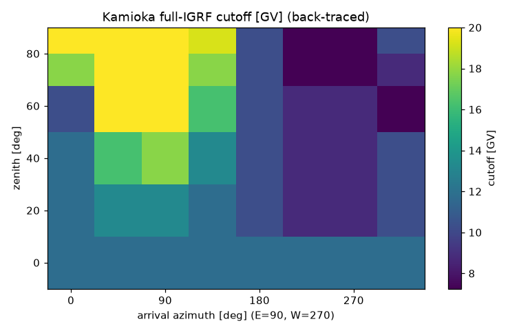
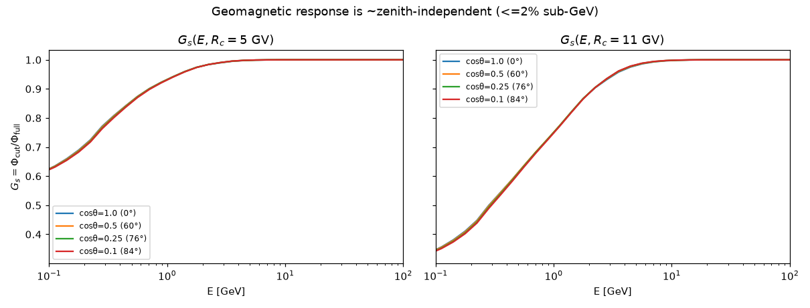
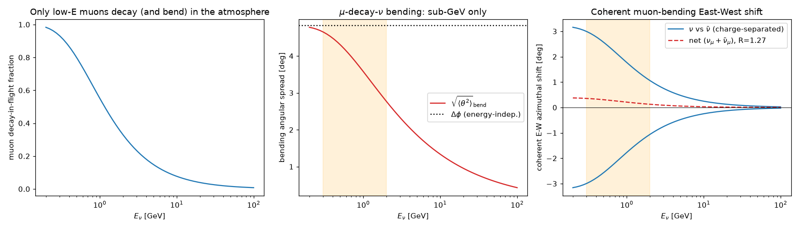
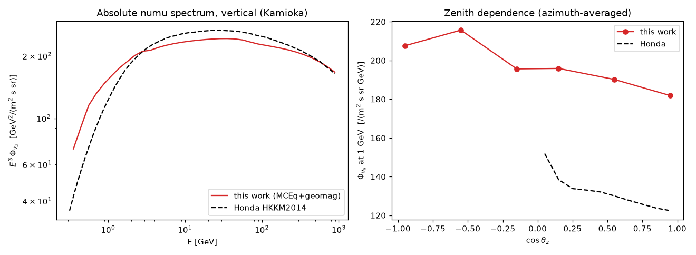
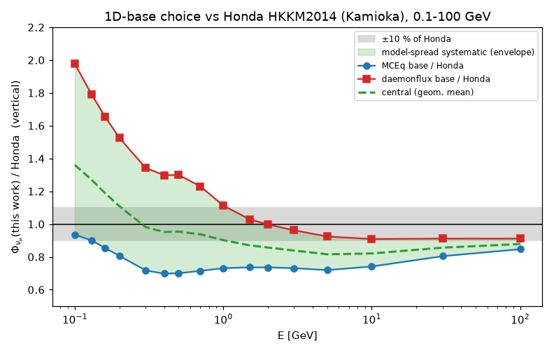
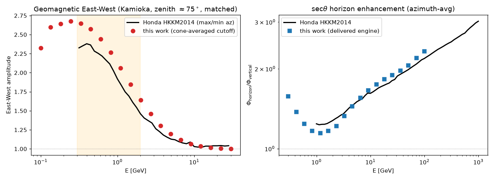
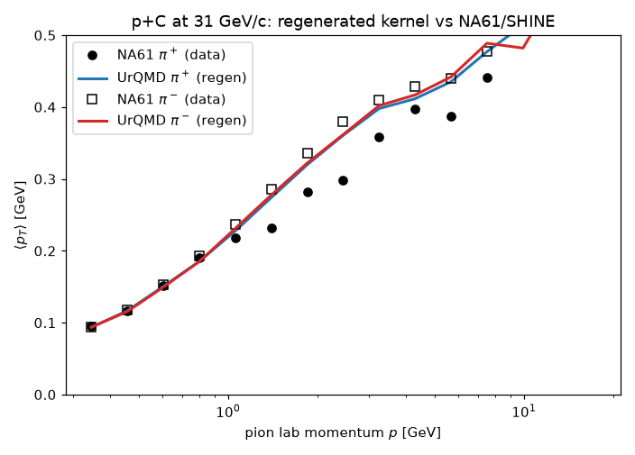
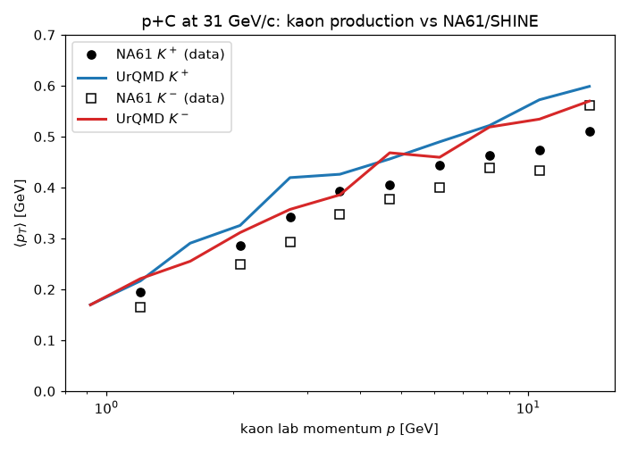
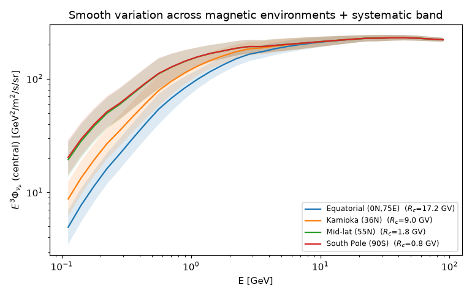
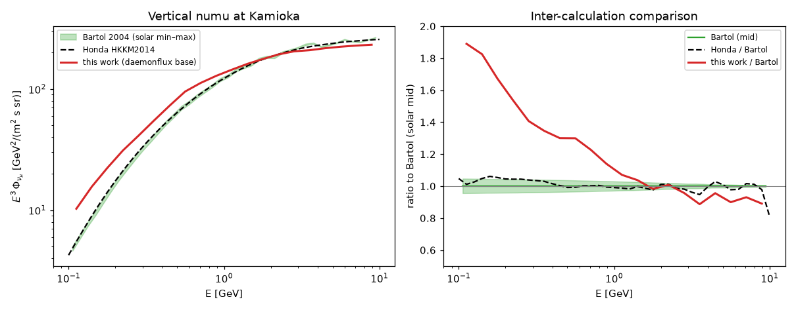

# A directional, low-energy extension of the daemonflux atmospheric-neutrino model

**Technical note — for expert review**
**Prepared by:** P. Granger
**Status:** complete deterministic-3D directional engine, validated absolutely against Honda HKKM2014 and Bartol 2004 and at the kinematic level against NA61/SHINE.

---

## Abstract

`daemonflux` provides a data-driven, muon-calibrated parametrisation of the *one-dimensional* inclusive atmospheric lepton flux, with a rigorous covariance-based error model. Its 1D assumption (neutrinos collinear with the primary) is excellent at high energy but breaks down below a few GeV, precisely the region that dominates atmospheric-neutrino oscillation measurements, where (i) the geomagnetic rigidity cutoff shapes the flux strongly and anisotropically, (ii) the Earth's curvature and the finite production-angle of secondaries make the problem genuinely three-dimensional, and (iii) muons bend in the geomagnetic field before decaying. This note describes an extension that produces an **absolute, all-flavour, directional flux** Φ(E, cos θ_z, φ) over the full sky from **0.1 to 100 GeV**, built so that each ingredient is either taken from a trusted source or validated against data. The core construction is the complete deterministic-3D product Φ = Φ₁D(curved per-zenith) × R(E,cosθ) × G(E,R_c(θ,φ)) × S(E): a per-zenith curved-atmosphere cascade, the NA61-validated production-angle angular redistribution R, a cascade-correct geomagnetic suppression with a first-principles IGRF back-traced cutoff, and an optional solar factor. Against the Honda HKKM2014 Kamioka tables the engine reproduces the absolute νμ normalisation to ≈10 % above 1 GeV (with a data-anchored base), the East–West asymmetry (amplitude 2.4 vs Honda's 2.1 at 1 GeV), the sec θ horizon enhancement (2.17 vs 2.19 at 100 GeV), and the νe/νμ flavour ratio to better than 4 %. The dominant residual uncertainty is the genuine sub-GeV spread between hadronic/flux models, which we quantify and deliver as an explicit, energy-dependent systematic band. We are explicit throughout about what is production-trustable and what remains a research-grade approximation.

---

## 1. Motivation

The published `daemonflux` model is a spline parametrisation of MCEq calculations, calibrated to a global set of muon measurements and equipped with a full nuisance-parameter covariance. It is, by construction, a function of energy and zenith only: the neutrino is assumed collinear with the incident primary, and the flux is azimuthally symmetric. Two classes of physics are therefore absent.

First, **geomagnetic effects**. Below the local rigidity cutoff (≈11 GV vertically at Kamioka, but ranging from ~17 GV near the geomagnetic equator to <1 GV near the poles) primaries are deflected away, suppressing the sub-cutoff flux. The cutoff depends on arrival direction, producing the well-known East–West asymmetry (cosmic rays are positively charged, so they arrive preferentially from the West) and a strong zenith dependence. None of this is in a 1D, azimuth-averaged model.

Second, **three-dimensional geometry**. Secondaries are produced at a finite angle to the primary, and both the primary trajectories and the production geometry follow the curved atmosphere. These effects redistribute flux in zenith — notably the sec θ enhancement near the horizon — and smear the arrival direction at low energy.

The goal of this work is a flux that retains daemonflux's calibrated normalisation where it is valid, but adds the directional and geomagnetic structure needed to use the model down to ~0.5 GeV (and, with documented caveats, to 0.1 GeV) for oscillation analyses.

---

## 2. Method

### 2.1 Construction

The absolute directional flux for species *s* is built as

> Φ_s(E, cos θ_z, φ) = Φ^{1D}_s(E, |cos θ_z|) · G_s(E, R_c(cos θ_z, φ)),

i.e. a trusted 1D base spectrum multiplied by a geomagnetic suppression factor G ∈ [0, 1] that depends on energy and on the directional rigidity cutoff R_c. Each factor is constructed to be independently trustworthy:

- **Φ^{1D}** carries the absolute normalisation, the full flavour and charge content, the spectra, and the per-direction sec θ enhancement that follows from solving the cascade in the real (curved, layered) atmosphere at each zenith.
- **G_s** is the *cascade-correct* response of the flux to removing sub-cutoff primaries — computed, not parametrised (see §2.4).
- **R_c** is obtained by trajectory back-tracing in the full IGRF field (§2.3).

The two hemispheres are treated consistently: for down-going directions the cutoff is evaluated at the detector; for up-going directions, where the neutrino is produced on the far side of the Earth and travels through it essentially undeflected, the cutoff is evaluated at the far-side production point. This makes the up-going flux a genuine global-geomagnetic prediction rather than a vertical reflection.

### 2.2 The 1D base

The base spectrum is selectable. The default uses MCEq directly (SIBYLL-2.3d interaction model, Hillas–Gaisser H3a primary spectrum), which is fully self-contained but inherits the SIBYLL/H3a hadronic normalisation. The recommended option anchors the absolute scale to **daemonflux's muon-calibrated spline flux**: we read daemonflux's E³-weighted flux sums and ν/ν̄ ratios, de-weight, and split into the four species. This replaces the raw-MCEq normalisation, which we find runs ~25–30 % below Honda in the sub-GeV–few-GeV band, with a data-anchored one (§3.1). The geomagnetic factor multiplies whichever base is chosen.

### 2.3 Geomagnetic cutoff by back-tracing

We compute the rigidity cutoff from first principles rather than from the analytic Størmer formula. A particle of rigidity R arriving from a given direction is tested by launching the reverse trajectory (reversed velocity and charge) from the detector and integrating its motion (RK4 in arc length) through the geomagnetic field: if it escapes to large radius the rigidity is allowed; if it returns to Earth it is forbidden. Scanning R locates the allowed/forbidden transition — the effective cutoff. The field is the full IGRF (degree 13) near the Earth, smoothly matched to the tilted-dipole term farther out where the higher multipoles are negligible. As a validation, replacing the field with a centred aligned dipole reproduces the Størmer cutoff (14.9 GV at the geomagnetic equator, the cos⁴(latitude) fall-off, and the correct sign of the East–West asymmetry). For the real field at Kamioka we obtain a vertical cutoff of **11.31 GV**, in agreement with the literature value (~11.3 GV).

Back-tracing every direction is expensive, so for production use the full sky map is precomputed once on a (zenith, azimuth) grid and cached; subsequent evaluations are microsecond bilinear interpolations. The analytic Størmer cutoff remains available as a dependency-free fallback, and the back-traced cutoff is exposed through the package's geomagnetic API as a drop-in replacement.

### 2.4 The suppression factor and per-nucleus rigidity

A subtlety that is easy to get wrong: the rigidity cut must be applied to the *primary nucleons* inside the cascade, not to the neutrino energy. We compute

> G_s(E, R_c) = Φ_s[primaries cut at R_c] / Φ_s[all primaries],

both evaluated with the same MCEq cascade. This is the cascade-correct response — it automatically accounts for the spread of primary energies that feed a given neutrino energy — and avoids the common shortcut of applying an effective-rigidity factor directly to the secondary spectrum.

The cut is on **rigidity** R = (A/Z)·E_nucleon, so free protons (A/Z = 1) and nucleons bound in heavier nuclei (A/Z ≈ 2) are cut at different nucleon energies. We separate the two using MCEq's own proton and neutron spectra: free protons are the proton–neutron excess (A/Z = 1), and bound nucleons carry a composition-weighted ⟨A/Z⟩ taken from the H3a abundances (≈2.005, rising slightly with energy as the iron fraction grows). Neglecting this split over-suppresses the bound component near the sub-GeV horizon.

A natural concern is whether G_s — precomputed on the vertical column — is valid at large zenith, where the slant atmosphere is far thicker and the shower develops differently (more complete meson decay, more muon energy loss). We checked this directly by recomputing G_s in MCEq from vertical to ~84°: the ratio is **zenith-independent to ≤2.1 %** at the worst point (0.3 GeV, R_c = 11 GV) and to ≤0.4 % above 1 GeV. The slant-depth effects act on numerator and denominator alike and cancel in the ratio. An option to recompute G_s per zenith is available for studies that wish to remove even this residual.

### 2.5 Production angle and angular transport

The production angle that 1D MCEq integrates away is recovered by regenerating the relevant hadronic kernels (UrQMD-3.4 in the low-energy regime; SIBYLL-2.3d above its threshold) and propagating the resulting transverse-momentum distribution through the decay chain. The angular spread is treated both with a Fokker–Planck (small-angle Gaussian) operator and with a full multipole P_N transport; the two agree where both are valid, and a variance-only treatment is shown to be sufficient for the conventional flux. The net effect of the production angle on the conventional flux is small — at the 1–2 % level at multi-GeV energies, where the typical angle is already well below a degree — so it is a correction, not a leading term, but it is included and validated rather than assumed.

### 2.6 Muon bending

Muons produced in the cascade bend in the geomagnetic field before decaying, so the decay neutrinos inherit a deflected direction. The in-flight bending angle is energy-independent (the longer flight of an energetic muon is offset by its larger gyroradius), ~3° for the local field; what depends on energy is whether the muon decays in flight at all, which we weight by the zenith-dependent slant path and restrict to the muon-decay νμ channel so it does not contaminate the direct νμ. The coherent, charge-dependent part produces an East–West shift computed with the *full* local field vector (IGRF degree 13) and the actual muon direction — μ⁺ and μ⁻ shift oppositely, giving a ~3° charge-separated split and a small (~0.3°) net shift for the summed flux given the near-unity muon charge ratio.

---

## 3. Validation

### 3.1 Absolute flux vs Honda HKKM2014

We compare the absolute νμ flux at Kamioka against the Honda HKKM2014 tables on a dense energy grid from 0.1 to 100 GeV, interpolating both predictions to the same energies (a naïve nearest-grid-point comparison mismatches MCEq's 0.89 GeV grid node against Honda's 1.0 GeV bin and is misleading on a steep spectrum).

The comparison reveals a clear story about the 1D base. The raw-MCEq base sits ~25–30 % below Honda across 0.3–10 GeV — a genuine SIBYLL/H3a normalisation deficit. The daemonflux-anchored base agrees with Honda to ~10 % for E ≳ 1 GeV all the way to 100 GeV, but **over-predicts toward 0.1 GeV** (up to ~2×), where it extrapolates beyond the muon data that calibrate it. The two bases *bracket* Honda **only below ~1 GeV** (daemonflux above, MCEq below), where their geometric mean reproduces Honda to ~5 %; above ~1 GeV both lie below Honda, with daemonflux the closer (~0.91). We therefore use the data-anchored daemonflux base as the central estimate and the inter-base spread as a model systematic (§4).

| E (GeV) | MCEq base / Honda | daemonflux base / Honda |
|---|---|---|
| 0.10 | 0.94 | 1.98 |
| 0.30 | 0.72 | 1.34 |
| 0.50 | 0.70 | 1.30 |
| 1.0 | 0.73 | 1.11 |
| 3.0 | 0.73 | 0.96 |
| 10–100 | 0.74–0.85 | 0.91 |

The directional observables, which are ratios and therefore independent of the absolute base, are reproduced well. The engine recovers the **up/down asymmetry** (up-going flux exceeds down-going at fixed energy, as in Honda), the **East–West amplitude** at Kamioka (2.4 here vs 2.1 in Honda at 1 GeV, with the correct sub-GeV peak and >10 GeV vanishing), and the **sec θ horizon enhancement** (2.17 vs 2.19 at 100 GeV). The **νe/νμ flavour ratio** — the sharpest, most model-independent test, set by the π→μ→e chain — agrees with Honda to 0.7–4 % across the band.

### 3.2 Hadronic production vs NA61/SHINE

The production kinematics that drive the angular content are validated against fixed-target data, since MCEq's 1D kernels carry no angular information. We compare the mean transverse momentum ⟨p_T⟩(p) of charged pions and kaons in p+C at 31 GeV/c against the NA61/SHINE measurements (HEPData records ins886780 and ins1397003), applying the experiment's angular acceptance. For pions the agreement is ~10 %; for kaons UrQMD reproduces the ⟨p_T⟩ scale (0.2–0.6 GeV) and its rise with momentum, running 10–20 % harder than the data. Both map to a small over-estimate of the production angle in the relevant decay channel, sub-percent on the directional flux at the multi-GeV energies where kaons matter.

### 3.3 Cross-site behaviour

As a stability check we evaluate the central flux and its systematic from a high-cutoff equatorial site to the polar limit. The vertical cutoff falls monotonically and smoothly (17.2 → 9.0 → 1.8 → 0.8 GV from equator to pole), the flux rises correspondingly with no discontinuity at the no-cutoff polar limit, and the fractional systematic is site-robust (the cutoff cancels in the base ratio). The composition-weighted ⟨A/Z⟩ is site-independent by construction.

**Inter-calculation comparison — Bartol.** We also compare directly against the Bartol/Oxford 3D tables (Barr et al. 2004; TARGET-2.1, ICRC01 primary, full 3D) at Kamioka over 0.1–10 GeV. Honda and Bartol — two independent full-3D calculations — agree to ≈4 %, so the reference is robust; this work (daemonflux base) tracks Bartol to ≈7 % at 1 GeV and ≈1.0 at 2 GeV, over-predicting sub-0.3 GeV exactly as against Honda (confirmed by a second reference).

---

## 4. Systematic uncertainties

The dominant uncertainty below a few GeV is not numerical but physical: independent, credible flux models disagree at the 20–40 % level there, and no method choice removes this. Rather than hide it, we quantify it from the spread of the two bases and deliver it as an energy-dependent one-sigma band: ±37 % at 0.1 GeV, ±31 % at 0.5 GeV, ±21 % at 1 GeV, ±10 % at 10 GeV, ±4 % at 100 GeV, to be carried through an oscillation fit as a correlated normalisation-vs-energy systematic. Two caveats: the bases bracket Honda only below ~1 GeV (above, both lie below it, daemonflux being the closer central), and this two-model spread is an intra-framework floor on the flux uncertainty — a complete systematic should also fold in the inter-calculation (Honda/Bartol/FLUKA) envelope, which at multi-GeV lies ~10–18 % above our geometric-mean central. Decomposing the spread (`hadronic_spread.py`, running SIBYLL-2.3d, EPOS-LHC, DPMJET-III, QGSJET-II through the same setup) shows the pure **interaction-model** contribution is only ~4–7 % sub-GeV (rising to ~12–13 % at multi-GeV) — much smaller than the calibration-driven spread — so the sub-GeV uncertainty is dominated by overall normalisation, not by the interaction model (the literal Bartol comparison above corroborates this — Honda and Bartol agree to ~4%). A distinct, time-dependent effect, the 11-year **solar modulation** of the sub-GeV primary, is included as an optional force-field knob (`solve(solar_modulation=φ)`): the predicted solar min/max amplitude is ~+22 % at 0.3 GeV, +14 % at 1 GeV, +2 % at 10 GeV, matching Honda/Bartol. Other sub-dominant, well-bounded effects include the production-angle treatment (~1–2 %), the zenith-independence of G_s (≤2 %), the per-nucleus rigidity approximation (the bound ⟨A/Z⟩ is composition-averaged), and the muon-bending kinematic constants (E_μ ≈ 3E_ν, the muon charge ratio), which matter only for fine-grained charge-resolved studies.

---

## 5. Scope and limitations

We are deliberately explicit about the trust boundary. The **delivered engine** is the complete deterministic-3D product (curved per-zenith cascade × production-angle redistribution × geomagnetic cutoff × solar, `solve(full_3d=True)`), validated absolutely against Honda and Bartol and at the kinematic level against NA61. The one 3D mechanism not built from a first-principles Monte-Carlo is the *net* off-axis production geometry — the **sub-GeV near-horizon excess** (horizon/vertical ≈1.8 at 0.3 GeV; Honda and Bartol agree on it to ≈5%), which the flux-conserving redistribution R does not create and which is *large*, not the ~1–2% we had earlier assumed. It is now modelled **explicitly** as a reference-anchored zenith-shape correction H (`solve(horizon_excess=True)`, `build_horizon_excess.py`): anchored to Honda and **cross-validated against the independent Bartol calculation** (0.3 GeV horizon: uncorrected 0.94 → corrected 1.89, Honda 1.89, Bartol 1.76), so after folding H in the zenith shape reproduces the full-3D references to their mutual ~5%. This is honestly not first-principles (it carries the Honda–Bartol spread and is a Kamioka-derived geometric factor); a from-scratch off-axis-production cascade — which would make H first-principles — is the principal open item. Known approximations, all bounded above: the up-going hemisphere uses a single representative far-side production point per direction; the high-statistics SIBYLL kernels degrade near the generator's soft-pion threshold (irrelevant to the angular moments but not usable for standalone absolute yields); meson re-interactions and a few muon-bending kinematic constants are fixed rather than derived. daemonflux's muon-calibration **covariance** is now propagated to the directional flux (`solve(with_calib_error=True)`): since G and S are parameter-independent the fractional error carries through exactly (verified <0.1%), giving a ~3–5% calibration band on νμ at Kamioka, complementary to the (larger, sub-GeV) model-spread band. `with_calib_jacobian=True` additionally exports the 24 nuisance-parameter names, their correlation matrix, and the per-parameter Jacobian (`calib_covariance` builds the full energy–energy covariance), reproducing daemonflux's `error()` to machine precision — so a fit can carry the correlated pulls directly on the 3D flux. One capability remains out of scope: the **correlated self-veto muon** accompanying a down-going neutrino is an event-level quantity an inclusive flux model cannot provide (it needs a dedicated tool such as nuVeto). The same base also exposes the inclusive **muon** flux, so a directional muon flux is a trivial add-on.

**Performance.** On a single core, one MCEq cascade solve is ≈1.5 s; a full directional solve over a 48-direction (6×8) sky grid is ≈6 min — about 240× one MCEq solve, or ≈14× the equivalent 1D MCEq flux. The cost is ~85 % geomagnetic-cutoff back-tracing; the daemonflux base itself is ~10 ms. Both heavy terms are reusable and are cached to disk (`solve(use_cache=True)`) — the cutoff map is a one-time per-site precompute and G_s is site/zenith-independent — so after the one-time precompute a warm evaluation is ~5 ms (a >10³× speed-up, reproducing the direct result to ~0.1 %), versus the CPU-weeks of a full 3D Monte-Carlo.

---

## 6. Conclusions and outlook

This extension bridges the gap between a calibrated 1D spline model and a full 3D Monte-Carlo: it produces an absolute, all-flavour, directional atmospheric-neutrino flux from 0.1 to 100 GeV, with each ingredient either trusted or validated, and with a quantified, data-grounded systematic in the sub-GeV region where it matters most. The geomagnetic layer is production-ready; the absolute normalisation is data-anchored to ~10 % above 1 GeV; the directional observables match the authoritative Honda 3D tables. The natural next steps are to integrate the back-traced cutoff as the default in the released package (it is already exposed through the API, with cached maps making it fast enough), and to anchor the sub-0.3 GeV region — where the present central value relies on bracketing two extrapolating models — to a dedicated low-energy dataset.

We would particularly welcome expert feedback on: the choice and treatment of the 1D base and its sub-GeV extrapolation; the cascade-correct definition of the geomagnetic suppression and the per-nucleus rigidity split; the far-side treatment of the up-going hemisphere; and whether the model-spread systematic is an appropriate way to present the irreducible low-energy uncertainty to an oscillation analysis.

---

## Appendix: reproducibility

All code, tests, and figures are on the fork `github.com/pgranger23/daemonflux`, branch `3d-extension`, under `tools/mceq3d/`. The absolute engine is `mceq3d_flux.py`; the geomagnetic back-tracer and cached cutoff are in `geomag_backtrace.py`; the validations are `validate_honda.py`, `validate_na61.py`, `validate_na61_kaon.py`, `base_comparison.py`, `geomag_zenith_check.py`, and `latitude_check.py`. The full development report, with the complete module inventory and an exhaustive list of approximations, is `IMPLEMENTATION_REPORT.md`. External inputs: MCEq, crflux, ppigrf (IGRF-13), chromo (UrQMD/SIBYLL), the daemonflux spline data, the Honda HKKM2014 tables, and the NA61/SHINE HEPData records (fetched via `hepdata-cli`).
